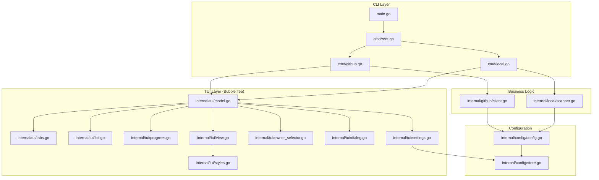

<h1 align="center">
   repo-sync
   <br>
   Repository Synchronization Tool with Interactive TUI
</h1>

<div align="center">
   <p>A powerful CLI tool for synchronizing repositories from GitHub or local sources with an interactive terminal UI powered by Bubble Tea</p>

   <div align="center">
      <a href="https://github.com/MoshPitCodes/repo.sync/stargazers">
         
      </a>
      <a href="https://github.com/MoshPitCodes/repo.sync/">
         
      </a>
      <a href="https://github.com/MoshPitCodes/repo.sync/blob/main/LICENSE">
         
      </a>
      <a href="https://go.dev/">
         
      </a>
   </div>
</div>

## Overview

`repo-sync` is a modern Go CLI application that simplifies repository management by providing an elegant, interactive terminal user interface for synchronizing repositories. Whether you need to clone GitHub repositories or copy local repositories to a unified location, repo-sync makes it effortless with its intuitive TUI.

Built with Bubble Tea and following The Elm Architecture, repo-sync offers both interactive and batch modes for maximum flexibility. The interactive mode provides a rich terminal experience with tabs, search, sorting, and real-time progress tracking, while batch mode enables seamless automation in scripts and CI/CD pipelines.

### Key Features

- **Interactive TUI** - Beautiful terminal UI with multi-select, search, filtering, and sorting
- **GitHub Integration** - Seamless integration with GitHub via the `gh` CLI
  - Browse personal and organization repositories
  - Switch between multiple GitHub owners/orgs with owner selector
  - Automatic authentication using GitHub CLI
- **Local Repository Discovery** - Automatically scans configured directories for Git repositories
- **Batch Mode** - Non-interactive mode for automation and scripting
- **Persistent Configuration** - Settings stored in `~/.config/repo-sync/config.json`
- **Smart Conflict Handling** - Interactive dialog when repositories already exist
- **Tabbed Navigation** - Quick switching between Personal, Organizations, and Local modes
- **Progress Tracking** - Real-time inline progress with detailed sync results
- **Keyboard-Driven** - Comprehensive keyboard shortcuts for all actions
- **Idiomatic Go** - Built following Go 1.24+ best practices and patterns

## Features Showcase

### Interactive Terminal UI
- **Tabbed Interface**: Switch between Personal, Organizations, and Local repositories with a single keypress
- **Smart Search**: Real-time filtering as you type
- **Flexible Sorting**: Sort by name, last updated, stars, or size
- **Multi-Select**: Select individual repos or use `a` to select all, `n` to deselect all
- **Owner Selector**: Quickly switch between your account and organizations
- **Visual Progress**: Inline progress bar with detailed sync results
- **Help Overlay**: Built-in help (`?` key) showing all keyboard shortcuts
- **Settings Panel**: Configure target directory, source directories, and preferences (`c` key)
- **Conflict Resolution**: Interactive dialog when repositories already exist

### Batch Mode
For automation and scripting, use batch mode to clone or copy specific repositories without interaction:
```bash
# Clone specific GitHub repos
repo-sync github --owner MoshPitCodes --batch repo1 repo2 repo3

# Copy specific local repos
repo-sync local --batch /path/to/repo1 /path/to/repo2
```

## How It Works

`repo-sync` provides three distinct modes for repository synchronization:

### 1. Personal Mode
Browse and clone your personal GitHub repositories. The tool authenticates using the GitHub CLI (`gh`) and fetches all repositories owned by your account. Select multiple repositories using the interactive interface and clone them to your target directory with a single command.

### 2. Organizations Mode
Switch to any GitHub organization you belong to and browse their repositories. Use the owner selector (`o` key) to quickly switch between different organizations. Perfect for managing work repositories or open-source projects across multiple organizations.

### 3. Local Mode
Discover Git repositories from configured source directories on your filesystem. This mode scans the directories you specify and presents all found repositories in the same interactive interface. Copy selected repositories to your target directory while preserving the Git history.

All modes support:
- Real-time search and filtering
- Multiple sort options (name, last updated, stars, etc.)
- Multi-select with visual feedback
- Inline progress tracking with detailed results
- Smart conflict handling when repositories already exist

## Use Cases

- **New Machine Setup**: Quickly clone all your repositories to a new development machine
- **Repository Organization**: Consolidate repositories from multiple locations into a unified directory
- **Team Onboarding**: Clone all organization repositories for new team members
- **Backup and Migration**: Copy local repositories to a backup location
- **Development Environment Sync**: Keep development, work, and personal repos organized in separate directories
- **Multi-Organization Management**: Easily switch between personal and multiple organization repositories
- **Automated Workflows**: Use batch mode in scripts to automate repository synchronization tasks

## Installation

### Prerequisites

- Go 1.24 or later
- Git
- GitHub CLI (`gh`) - for GitHub synchronization
- Authenticated GitHub account (run `gh auth login`)

### Build from Source

```bash
# Clone the repository
git clone https://github.com/MoshPitCodes/repo.sync.git
cd repo.sync

# Build the binary
go build -o repo-sync

# Install globally (optional)
go install
```

### Using Go Install

```bash
go install github.com/MoshPitCodes/repo.sync@latest
```

## Quick Start

### Interactive Mode

Launch the interactive TUI menu:

```bash
repo-sync
```

This launches a tabbed interface with three modes:
- **Personal** - Browse your personal GitHub repositories
- **Organizations** - Browse organization repositories
- **Local** - Browse local Git repositories from configured directories

### GitHub Mode

Sync repositories from GitHub interactively:

```bash
repo-sync github --owner MoshPitCodes
```

Or use batch mode to clone specific repositories:

```bash
repo-sync github --owner MoshPitCodes --batch repo1 repo2 repo3
```

### Local Mode

Sync local repositories interactively:

```bash
repo-sync local
```

Or use batch mode to copy specific repositories:

```bash
repo-sync local --batch /path/to/repo1 /path/to/repo2
```

## Configuration

Configure `repo-sync` using environment variables:

| Variable | Description | Default |
|----------|-------------|---------|
| `REPO_SYNC_TARGET_DIR` | Target directory for cloning/copying repositories | `~/repos` |
| `REPO_SYNC_GITHUB_OWNER` | Default GitHub owner/organization | Current user |
| `REPO_SYNC_SOURCE_DIRS` | Colon-separated list of directories to scan for local repos | None |

Settings can also be configured interactively by pressing `c` in the TUI. Configuration is persisted to `~/.config/repo-sync/config.json` and includes:

- Target directory for synchronized repositories
- Source directories for local repository scanning
- Default GitHub owner
- Recent owners list
- UI preferences (compact mode)

### Example Configuration

```bash
# Add to ~/.bashrc or ~/.zshrc
export REPO_SYNC_TARGET_DIR="$HOME/projects"
export REPO_SYNC_GITHUB_OWNER="MoshPitCodes"
export REPO_SYNC_SOURCE_DIRS="$HOME/dev:$HOME/work:$HOME/personal"
```

## Usage

### Command Reference

```
repo-sync                                         # Launch interactive TUI with tabs
repo-sync github                                  # GitHub interactive mode (Personal tab)
repo-sync github --owner <owner>                  # GitHub mode with specific owner
repo-sync github --owner <owner> --batch <repos...>  # Batch clone repos
repo-sync local                                   # Local interactive mode
repo-sync local --batch <paths...>                # Batch copy repos
```

### Interactive Features

#### Tab Navigation

- **Personal (1)**: View your personal GitHub repositories
- **Organizations (2)**: View organization repositories (use `o` to switch owners)
- **Local (3)**: View local repositories from configured directories
- **Switch Tabs**: Press `1`, `2`, or `3` to jump directly, or use `tab`/`shift+tab`

#### Repository List View

- **Navigation**: Use `↑`/`↓` or `k`/`j` to navigate, `pgup`/`pgdown` for pages
- **Selection**: Press `space` to toggle selection
- **Select All**: Press `a` to select all repositories
- **Deselect All**: Press `n` to deselect all
- **Search**: Press `/` to enter search/filter mode
- **Sort**: Press `s` to cycle through sort modes (name, updated, stars, etc.)
- **Owner**: Press `o` to open the owner selector (GitHub modes only)
- **Settings**: Press `c` to open configuration settings
- **Help**: Press `?` to view keyboard shortcuts
- **Sync**: Press `enter` to start synchronization
- **Quit**: Press `q` or `ctrl+c` to exit

#### Search/Filter Mode

- Type to filter repositories in real-time
- Filter applies to repository names
- Press `enter` or `esc` to exit search mode

### Examples

#### Browse and Clone GitHub Repositories

```bash
# Launch the TUI
repo-sync

# In the TUI:
# 1. Press '1' for Personal repos or '2' for Organizations
# 2. Press 'o' to switch owner (if needed)
# 3. Use arrow keys to navigate
# 4. Press 'space' to select repositories
# 5. Press '/' to search/filter
# 6. Press 's' to sort
# 7. Press 'enter' to clone selected repositories
```

#### Batch Clone Specific Repositories

```bash
repo-sync github --owner MoshPitCodes --batch \
  repo.sync \
  moshpitcodes.template \
  moshpitcodes.nixos
```

#### Discover and Copy Local Repositories

```bash
# Configure source directories (or set via Settings with 'c' in TUI)
export REPO_SYNC_SOURCE_DIRS="$HOME/dev:$HOME/projects"

# Launch the TUI
repo-sync

# In the TUI:
# 1. Press '3' to switch to Local tab
# 2. Browse discovered repositories from configured directories
# 3. Select repositories with 'space'
# 4. Press 'enter' to copy to target directory
```

## Architecture



### Project Structure

```
repo.sync/
├── cmd/
│   ├── root.go           # Root command and TUI launcher
│   ├── github.go         # GitHub subcommand (batch/interactive)
│   └── local.go          # Local subcommand (batch/interactive)
├── internal/
│   ├── config/
│   │   ├── config.go     # Configuration management
│   │   └── store.go      # Persistent config storage
│   ├── github/
│   │   └── client.go     # GitHub API client (via go-gh)
│   ├── local/
│   │   └── scanner.go    # Local filesystem scanner
│   └── tui/
│       ├── model.go      # Main Bubble Tea model
│       ├── view.go       # View rendering
│       ├── tabs.go       # Tab bar (Personal/Orgs/Local)
│       ├── list.go       # Repository list view
│       ├── progress.go   # Inline progress tracking
│       ├── settings.go   # Settings overlay
│       ├── owner_selector.go  # GitHub owner selector
│       ├── dialog.go     # Repository exists dialog
│       ├── messages.go   # Bubble Tea messages
│       ├── keymap.go     # Keyboard shortcuts
│       └── styles.go     # Lipgloss styles
├── main.go               # Application entry point
├── go.mod                # Go module definition
└── README.md             # This file
```

## Technology Stack

- **Language**: Go 1.24+
- **TUI Framework**: [Bubble Tea v1.2+](https://github.com/charmbracelet/bubbletea) - Terminal UI framework using The Elm Architecture
- **UI Components**: [Bubbles v0.20+](https://github.com/charmbracelet/bubbles) - Reusable TUI components
- **Styling**: [Lipgloss v1.0+](https://github.com/charmbracelet/lipgloss) - Style definitions and rendering
- **GitHub API**: [go-gh v2](https://github.com/cli/go-gh) - Official GitHub CLI library
- **CLI Framework**: [Cobra v1.8+](https://github.com/spf13/cobra) - Command-line interface structure

## Development

### Building

```bash
# Build for current platform
go build -o repo-sync

# Build with version info
go build -ldflags "-X main.version=1.0.0" -o repo-sync

# Build for multiple platforms
GOOS=linux GOARCH=amd64 go build -o repo-sync-linux-amd64
GOOS=darwin GOARCH=amd64 go build -o repo-sync-darwin-amd64
GOOS=windows GOARCH=amd64 go build -o repo-sync-windows-amd64.exe
```

### Testing

```bash
# Run tests
go test ./...

# Run tests with coverage
go test -cover ./...

# Run tests with race detection
go test -race ./...
```

### Code Quality

```bash
# Format code
gofmt -w .
goimports -w .

# Lint code
golangci-lint run

# Vet code
go vet ./...
```

## Contributing

Contributions are welcome! Please follow these guidelines:

1. Fork the repository
2. Create a feature branch (`git checkout -b feature/amazing-feature`)
3. Commit your changes using conventional commits
4. Push to the branch (`git push origin feature/amazing-feature`)
5. Open a Pull Request

### Conventional Commits

We use conventional commits for clear commit history:

- `feat:` - New features
- `fix:` - Bug fixes
- `docs:` - Documentation changes
- `refactor:` - Code refactoring
- `test:` - Test updates
- `chore:` - Maintenance tasks

## License

This project is licensed under the Apache License 2.0 - see the [LICENSE](LICENSE) file for details.

## Credits

Built with:

- [Bubble Tea](https://github.com/charmbracelet/bubbletea) - Terminal UI framework
- [Bubbles](https://github.com/charmbracelet/bubbles) - TUI components
- [Lipgloss](https://github.com/charmbracelet/lipgloss) - Style definitions
- [go-gh](https://github.com/cli/go-gh) - GitHub API client
- [Cobra](https://github.com/spf13/cobra) - CLI framework

## Support

- Report bugs via [GitHub Issues](https://github.com/MoshPitCodes/repo.sync/issues)
- Ask questions in [GitHub Discussions](https://github.com/MoshPitCodes/repo.sync/discussions)

---

<div align="center">
   Made with ❤️ by <a href="https://github.com/MoshPitCodes">MoshPitCodes</a>
</div>
